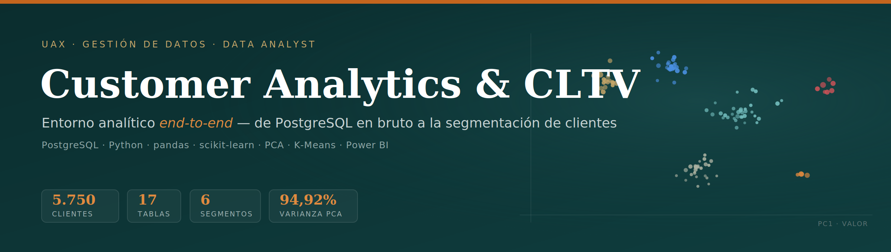
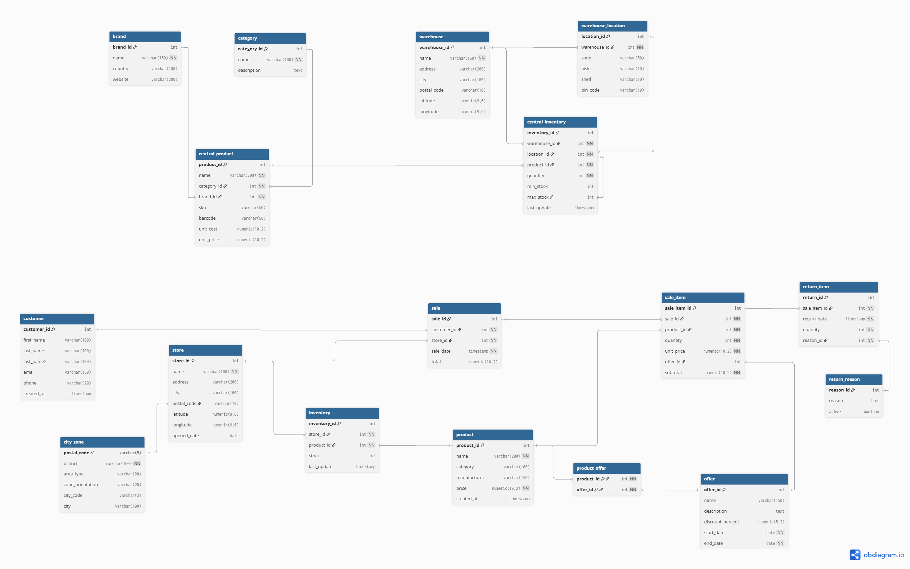
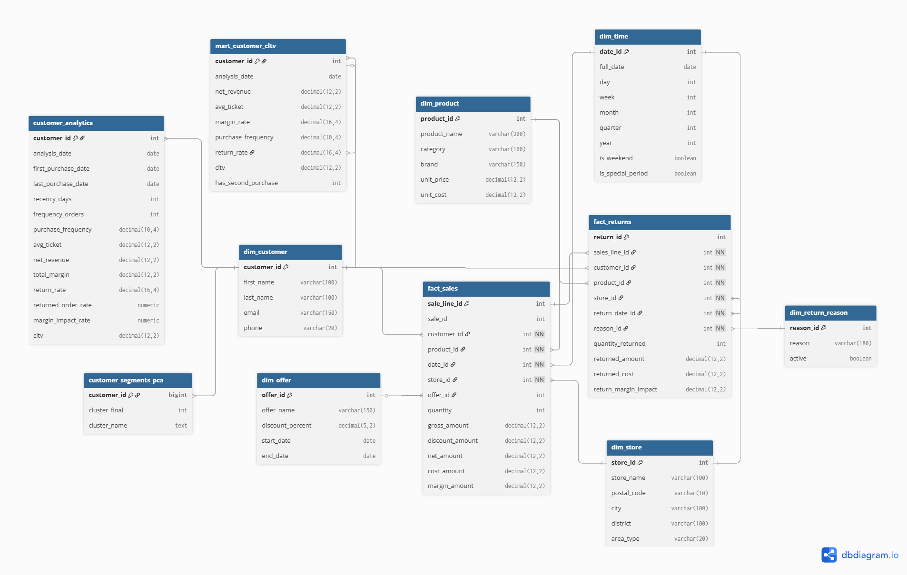
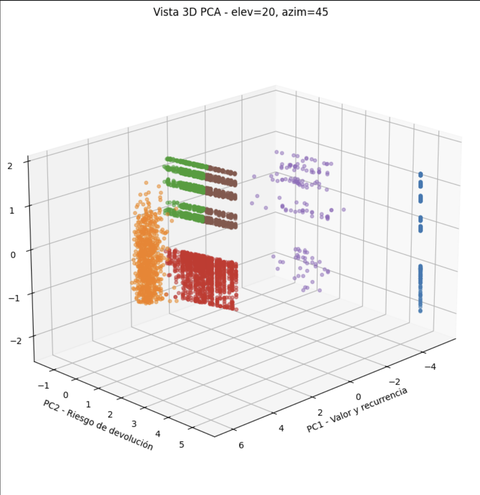

<p align="center">
  
</p>

<p align="center">
  <a href="https://luciacantos.github.io/trabajofinal_gestion/"><b>🔗 Dashboard interactivo</b></a> &nbsp;·&nbsp;
  <a href="docs/Proyecto_final.pdf"><b>📄 Memoria del proyecto</b></a>
</p>

<p align="center">
  
  
  
</p>

> Construcción de un entorno analítico completo sobre **PostgreSQL**: desde una base de datos relacional en bruto hasta la **segmentación de 5.750 clientes** mediante CLTV, PCA y K-Means, con explotación visual en **Power BI**.

---

## 🎯 Objetivo

Transformar la base de datos relacional de una empresa del sector salud (**17 tablas**: clientes, ventas, productos, almacenes, inventario, devoluciones y promociones) en un sistema preparado para el análisis, con el fin de **calcular el Customer Lifetime Value (CLTV)** y **segmentar a los clientes** en grupos diferenciados y accionables para la toma de decisiones de negocio.

## 🧱 Arquitectura de datos

Todo el entorno se organiza en **tres capas dentro de PostgreSQL**, lo que permite reejecutar el ETL sin tocar el origen y aislar el análisis de los datos en bruto:

| Capa | Esquema | Contenido |
|------|---------|-----------|
| Raw | `public` | 17 tablas originales restauradas desde el *backup* |
| Staging | `staging` | Versiones limpias y normalizadas (`*_limpia`) generadas por el ETL |
| DWH | `dwh` | Modelo dimensional en estrella + *marts* analíticos |

<!-- Sustituye estas líneas por tus imágenes reales una vez subidas a docs/ -->
| Modelo entidad-relación (origen) | Modelo dimensional (estrella) |
|:---:|:---:|
|  |  |

## ⚙️ Pipeline analítico

1. **Restauración** de la base de datos relacional en una instancia local de PostgreSQL (capa `public`).
2. **Modelo entidad-relación** del origen, agrupando las 17 tablas en 6 bloques funcionales.
3. **Modelo dimensional en estrella**: 2 tablas de hechos (`fact_sales`, `fact_returns`), 6 dimensiones conformadas (`dim_customer`, `dim_product`, `dim_store`, `dim_time`, `dim_offer`, `dim_return_reason`) y 3 *marts* analíticos.
4. **ETL en Python** (`ETL.py`) con **pandas** (transformación) y **SQLAlchemy** (conexión), generando en paralelo 3 salidas: CSV individuales, un Excel consolidado y la carga en `staging`.
5. **Tabla analítica de clientes** (`customer_analytics`): 5.750 filas, una por cliente, con ~30 variables RFM, de valor, margen y riesgo de devolución.
6. **Cálculo del CLTV** y dos métricas complementarias (tasa de devolución / impacto en margen, y rentabilidad neta del cliente).
7. **PCA**: 9 variables → 3 componentes principales que explican el **94,92 %** de la varianza.
8. **Clustering K-Means** con `k = 6` segmentos.
9. **Explotación visual** en Power BI y dashboard web interactivo.

## 🔬 Componentes principales (PCA)

Las tres primeras componentes resumen el comportamiento del cliente en tres preguntas de negocio:

| Componente | Varianza | Interpretación |
|:----------:|:--------:|----------------|
| PC1 | 59,52 % | **Valor y recurrencia** — ¿cuánto vale el cliente? |
| PC2 | 26,33 % | **Riesgo de devolución** — ¿qué riesgo introduce? |
| PC3 | 9,07 % | **Inactividad** — ¿sigue activo? |

## 📊 Resultados: 6 segmentos de cliente

Segmentación final sobre 5.750 clientes (*silhouette score* = 0,515). Se eligió `k = 6` priorizando el sentido de negocio frente al óptimo matemático (`k = 3`), que concentraba el 80 % de clientes en un único grupo poco accionable.

| # | Segmento | Clientes | % | CLTV medio | Rasgo clave |
|:-:|----------|:--------:|:--:|:----------:|-------------|
| 1 | Premium recurrentes | 750 | 13,0 % | 4.601,90 € | ~20 pedidos, devolución 2,5 % |
| 3 | Recientes bajo valor | 1.359 | 23,6 % | 67,28 € | 1 pedido, sin devoluciones |
| 2 | Dormidos ticket medio | 1.742 | 30,3 % | 102,04 € | ticket 255 €, inactivos |
| 5 | Dormidos bajo ticket | 1.459 | 25,4 % | 23,71 € | ticket 59 €, inactivos |
| 4 | Alta devolución parcial | 141 | 2,5 % | 53,02 € | devolución 47,9 % |
| 0 | Devolución total | 299 | 5,2 % | 0,00 € | devolución 100 % |



## 📈 Dashboard

El dashboard se conecta directamente al modelo dimensional (`dwh`) y se estructura en KPIs generales → análisis por segmento → detalle por producto y zona.

- 🔗 **[Versión web interactiva](https://luciacantos.github.io/trabajofinal_gestion/)** (no requiere instalación)
- 📥 **[Archivo Power BI (.pbix)](powerbi/Dashboards-powerbi.pbix)** para abrir en Power BI Desktop


## 🛠️ Stack técnico

- **Lenguajes:** Python, SQL
- **Librerías:** pandas, NumPy, scikit-learn, SQLAlchemy, matplotlib
- **Base de datos:** PostgreSQL (modelo dimensional en estrella)
- **BI / Visualización:** Power BI, dashboard web (Chart.js + Leaflet)

## 📁 Estructura del repositorio

```text
trabajofinal_gestion/
├── README.md
├── ETL.py                     # Pipeline ETL (extracción, limpieza, carga)
├── prueba_conexion.py         # Test de conexión a PostgreSQL
├── notebooks/                 # PCA, clustering y análisis
├── datos_limpios/             # 17 tablas limpias (salida del ETL)
├── powerbi/
│   └── Dashboards-powerbi.pbix
├── docs/
│   ├── Proyecto_final.pdf      # Memoria completa
│   ├── banner.png              # Cabecera del README
│   └── *.png                   # Diagramas y capturas
└── index.html                 # Dashboard web interactivo (GitHub Pages)
```

## 🚀 Cómo reproducirlo

```bash
# 1. Clonar el repositorio
git clone https://github.com/luciacantos/trabajofinal_gestion.git
cd trabajofinal_gestion

# 2. Instalar dependencias
pip install pandas numpy scikit-learn sqlalchemy psycopg2-binary openpyxl

# 3. Configurar la conexión a PostgreSQL y ejecutar el ETL
python ETL.py
```

## 👤 Autora

**Lucía Cantos Burgos** — Grado en Ingeniería Matemática, Universidad Alfonso X El Sabio
[GitHub](https://github.com/luciacantos)
